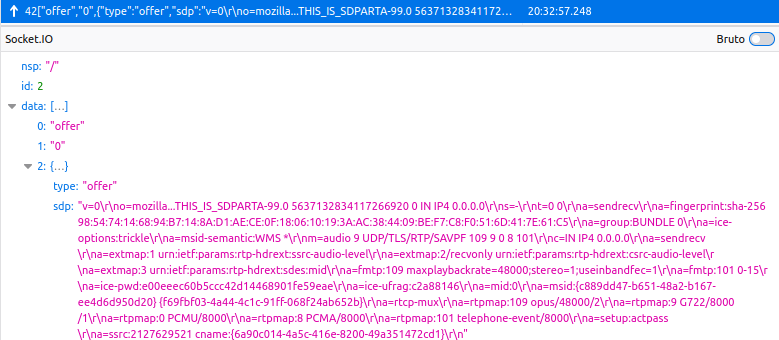
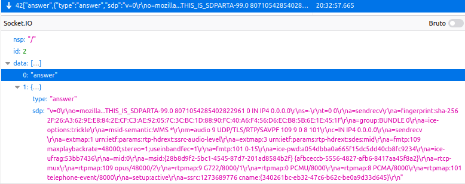

Nome: Luiza Alves da Silva

## Sinalização

Ao entrar na sala e clicar no cadeado, é feita uma requisição para uso do protocolo websocket, onde é gerado um id único (sid):

**Payload**

```
EIO: 4
transport: websocket
sid: ZMNXGDA36tJy14ymAAAG
```

**General**

```
Request URL: wss://3000-luizaalves-smu20222-c6dr2j8ombe.ws-us79.gitpod.io/socket.io/?EIO=4&transport=websocket&sid=ZMNXGDA36tJy14ymAAAG
Request Method: GET
Status Code: 101 Switching Protocols

```

Ao processar essas informações, aparecem várias opções para escolha da sala. Após selecionar a sala desejada para iniciar o jogo, o servidor recebe via socket um evento chamado 'entrar-na-sala' e gera então o ID para o jogador.

Caso do primeiro jogador entrando na sala, faz a captura do microfone.

```
Pedido de entrada na sala 0.

Object { primeiro: "gckii83Cegkt6dXFAAAB" }
```

Caso do segundo jogador entrar na sala .

```
Pedido de entrada na sala 0.
Object { primeiro: "gckii83Cegkt6dXFAAAB", segundo: "kmyNXkHob_aHzBplAAAD" }
```

Em seguida, envia a todos a lista atual de jogadores (mesmo incompleta). 

## Negociação de mídia com SDP

- Descrição de mídia com SDP;

Quando segundo jogador entra na sala, ele envia um evento chamado 'offer' para o primeiro jogador, que aceita automaticamente. 



Em seguida recebe a resposta com outro evento chamado 'answer', seria a resposta do primeiro jogador para o segundo;



Nas mensagens json trocadas, no campo sdp  que é onde acontece a negociação da mídia e áudio, que pode ser melhor visualizada abaixo;

```
v=0
o=mozilla...THIS_IS_SDPARTA-99.0 5637132834117266920 0 IN IP4 0.0.0.0
s=-
t=0 0
a=sendrecv
a=fingerprint:sha-256 98:54:74:14:68:94:B7:14:8A:D1:AE:CE:0F:18:06:10:19:3A:AC:38:44:09:BE:F7:C8:F0:51:6D:41:7E:61:C5
a=group:BUNDLE 0
a=ice-options:trickle
a=msid-semantic:WMS *
m=audio 9 UDP/TLS/RTP/SAVPF 109 9 0 8 101
c=IN IP4 0.0.0.0
a=sendrecv
a=extmap:1 urn:ietf:params:rtp-hdrext:ssrc-audio-level
a=extmap:2/recvonly urn:ietf:params:rtp-hdrext:csrc-audio-level
a=extmap:3 urn:ietf:params:rtp-hdrext:sdes:mid
a=fmtp:109 maxplaybackrate=48000;stereo=1;useinbandfe
c=1
a=fmtp:101 0-15
a=ice-pwd:e00eeec60b5ccc42d14468901fe59eae
a=ice-ufrag:c2a88146
a=mid:0
a=msid:{c889dd47-b651-48a2-b167-ee4d6d950d20} {f69fbf03-4a44-4c1c-91ff-068f24ab652b}
a=rtcp-mux
a=rtpmap:109 opus/48000/2
a=rtpmap:9 G722/8000/1
a=rtpmap:0 PCMU/8000
a=rtpmap:8 PCMA/8000
a=rtpmap:101 telephone-event/8000
a=setup:actpass
a=ssrc:2127629521 cname:{6a90c014-4a5c-416e-8200-49a351472cd1}
```


## Codecs

Os codecs ofertados seguiram a [RFC 3551](https://tools.ietf.org/html/rfc3551) e foram aceitados por ambas as partes:

```
Codecs suportados:
a=rtpmap:109 opus/48000/2
a=rtpmap:9 G722/8000/1
a=rtpmap:0 PCMU/8000
a=rtpmap:8 PCMA/8000
a=rtpmap:101 telephone-event/8000
```


### Escolha de caminho e transporte de mídia

O servidor recebe um evento 'candidate' e como resposta envia o caminho. O cenário contempla IPv4 e IPv6. Assim a oferta de endereços se limitou a essa pilha:

```
1 UDP 1685987327 189.11.168.76 43541 typ srflx raddr 192.168.100.7 rport 43541
1 UDP 2122252543 2804:d57:4f08:5000:c5a1:cbca:5a97:fe2e 43327 typ host

2 UDP 2122187006 192.168.100.7 55510 typ host
2 UDP 2122252542 2804:d57:4f08:5000:c5a1:cbca:5a97:fe2e 40136 typ host

1 TCP 2105458943 192.168.100.7 9 typ host tcptype active
1 TCP 2105524479 2804:d57:4f08:5000:c5a1:cbca:5a97:fe2e 9 typ host tcptype active

2 TCP 2105458942 192.168.100.7 9 typ host tcptype active"
2 TCP 2105524478 2804:d57:4f08:5000:c5a1:cbca:5a97:fe2e 9 typ host tcptype active
```

