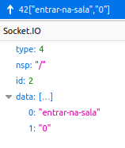
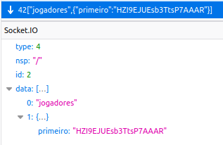
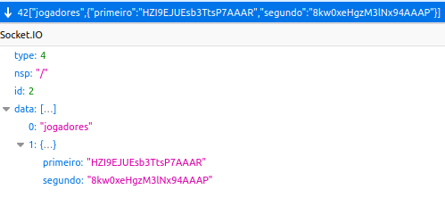
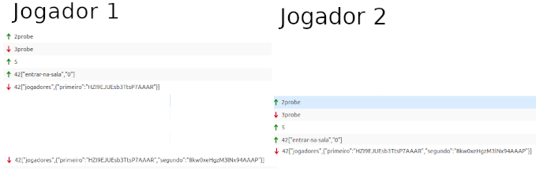
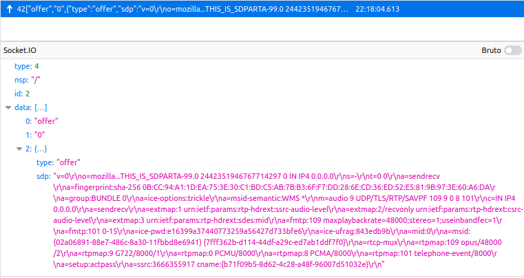
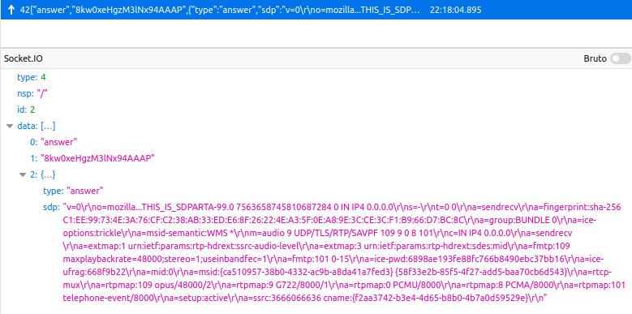

Nome: Luiza Alves da Silva

## Sinalização

Ao clicar no cadeado e entrar na sala, é feita uma requisição para uso do protocolo websocket, onde é gerado um id único (sid):

**General**

```
Request URL: wss://3000-luizaalves-smu20222-c6dr2j8ombe.ws-us79.gitpod.io/socket.io/?EIO=4&transport=websocket&sid=ZMNXGDA36tJy14ymAAAG
Request Method: GET
Status Code: 101 Switching Protocols

```

**Payload**

```
EIO: 4
transport: websocket
sid: HZI9EJUEsb3TtsP7AAAR(jogador 1) ou 8kw0xeHgzM3lNx94AAAP(jogador 2)
```

* **Requisição**: Ao escolher uma sala para entrar,  o servidor recebe via socket um evento chamado 'entrar-na-sala';

* **Resposta**: O servidor responde ao usuário a lista de jogadores da sala, o servidor responde via socket a lista de 'jogadores' na sala;

* **Mensagens**: 

  * No formato JSON onde pode ser visualizado a mensagem da requisição abaixo:

  

  * No formato JSON onde pode ser visualizado a mensagem da resposta abaixo para todos na sala, que por enquanto é apenas o jogador 1

    

  * No formato JSON onde pode ser visualizado a mensagem da resposta abaixo para todos na sala, que é ambos os jogadores:

    

* **Transações e dialógos**: Para melhor entendimento, abaixo pode ser visto a sequencia de mensagens trocadas, seta para cima verde é que foi enviado ao servidor uma mensagem e seta para baixo vermelha é que foi recebida do servidor uma mensagem. Jogador 1 inicia entrando na sala e o servidor envia a lista de jogadores, que é só ele, em seguida, o jogador 2 entra na sala e o servidor envia a lista de jogadores, que é ambos jogador 1 e jogador 2;



No console log, caso do primeiro jogador entrando na sala, faz a captura do microfone.

```
Pedido de entrada na sala 0.

Object { primeiro: "HZI9EJUEsb3TtsP7AAAR" }
Object { primeiro: "HZI9EJUEsb3TtsP7AAAR", segundo: "8kw0xeHgzM3lNx94AAAP" }
```

No console log, caso do segundo jogador entrar na sala .

```
Pedido de entrada na sala 0.
Object { primeiro: "HZI9EJUEsb3TtsP7AAAR", segundo: "8kw0xeHgzM3lNx94AAAP" }
```

Em seguida, envia a todos a lista atual de jogadores (mesmo incompleta). 

## Negociação de mídia com SDP

- Descrição de mídia com SDP;

Quando segundo jogador entra na sala, ele envia um evento chamado 'offer' para o primeiro jogador, que aceita automaticamente. 



Na mensagem do tipo 'offer' no campo sdp  que é onde acontece a negociação da mídia e áudio, que pode ser melhor visualizada abaixo;

```
v=0
o=mozilla...THIS_IS_SDPARTA-99.0 2442351946767714297 0 IN IP4 0.0.0.0
s=-
t=0 0
a=sendrecv
a=fingerprint:sha-256 0B:CC:94:A1:1D:EA:75:3E:30:C1:BD:C5:AB:7B:B3:6F:F7:DD:28:6E:CD:36:ED:52:E5:81:9B:97:3E:60:A6:DA
a=group:BUNDLE 0
a=ice-options:trickle
a=msid-semantic:WMS *
m=audio 9 UDP/TLS/RTP/SAVPF 109 9 0 8 101
c=IN IP4 0.0.0.0
a=sendrecv
a=extmap:1 urn:ietf:params:rtp-hdrext:ssrc-audio-level
a=extmap:2/recvonly urn:ietf:params:rtp-hdrext:csrc-audio-level
a=extmap:3 urn:ietf:params:rtp-hdrext:sdes:mid
a=fmtp:109 maxplaybackrate=48000;stereo=1;useinbandfec=1
a=fmtp:101 0-15
a=ice-pwd:e16399a37440773259a56427d733bfe6
a=ice-ufrag:843edb9b
a=mid:0
a=msid:{02a06891-88e7-486c-8a30-11fbbd8e6941} {7fff362b-d114-44df-a29c-ed7ab1ddf7f0}
a=rtcp-mux
a=rtpmap:109 opus/48000/2
a=rtpmap:9 G722/8000/1
a=rtpmap:0 PCMU/8000
a=rtpmap:8 PCMA/8000
a=rtpmap:101 telephone-event/8000
a=setup:actpass
a=ssrc:3666355917 cname:{b71f09b5-8d62-4c28-a48f-96007d51032e}
```

Em seguida recebe a resposta com outro evento chamado 'answer', seria a resposta do primeiro jogador para o segundo;



Na mensagem do tipo 'answer' no campo sdp  que é onde acontece a negociação da mídia e áudio, que pode ser melhor visualizada abaixo;

```
v=0
o=mozilla...THIS_IS_SDPARTA-99.0 7563658745810687284 0 IN IP4 0.0.0.0
s=-
t=0 0
a=sendrecv
a=fingerprint:sha-256 C1:EE:99:73:4E:3A:76:CF:C2:38:AB:33:ED:E6:8F:26:22:4E:A3:5F:0E:A8:9E:3C:CE:3C:F1:B9:66:D7:BC:8C
a=group:BUNDLE 0
a=ice-options:trickle
a=msid-semantic:WMS *
m=audio 9 UDP/TLS/RTP/SAVPF 109 9 0 8 101
c=IN IP4 0.0.0.0
a=sendrecv
a=extmap:1 urn:ietf:params:rtp-hdrext:ssrc-audio-level
a=extmap:3 urn:ietf:params:rtp-hdrext:sdes:mid
a=fmtp:109 maxplaybackrate=48000;stereo=1;useinbandfe
c=1
a=fmtp:101 0-15
a=ice-pwd:6898ae193fe88fc766b8490ebc37bb16
a=ice-ufrag:668f9b22
a=mid:0
a=msid:{ca510957-38b0-4332-ac9b-a8da41a7fed3} {58f33e2b-85f5-4f27-add5-baa70cb6d543}
a=rtcp-mux
a=rtpmap:109 opus/48000/2
a=rtpmap:9 G722/8000/1
a=rtpmap:0 PCMU/8000
a=rtpmap:8 PCMA/8000
a=rtpmap:101 telephone-event/8000
a=setup:active
a=ssrc:3666066636 cname:{f2aa3742-b3e4-4d65-b8b0-4b7a0d59529e}
```


## Codecs

Os codecs ofertados seguiram a [RFC 3551](https://tools.ietf.org/html/rfc3551) e foram aceitados por ambas as partes:

```
Codecs suportados:
a=rtcp-mux
a=rtpmap:109 opus/48000/2
a=rtpmap:9 G722/8000/1
a=rtpmap:0 PCMU/8000
a=rtpmap:8 PCMA/8000
a=rtpmap:101 telephone-event/8000
```

* Protocolo RTP: destina-se ao uso em conferências de áudio e vídeo com controle mínimo de sessão. 
  * Opus é um codificador de áudio e fala.
  * O codificador G.722 produz um fluxo de octetos, cada um dos quais DEVERÁ ser alinhado em um pacote RTP. 
  * PCMU e PCMA: Os dados de áudio são codificados como oito bits por amostra, após escala logarítmica. PCMU denota escala mu-law, escala PCMA A-law. 
* Via protocolo RTP com possíveis 5 codecs numerados 109, 9, 0, 8 e 101, onde:
  Codec 109 é definido como opus em 48000Hz;
  Codec 9 é definido como G722 em 8000Hz;
  Codec 0 é definido como PCMU em 8000Hz;
  Codec 8 é definido como PCMA em 8000Hz;
  Codec 101 é definido como “telephone-event” em 8000Hz.

* **a=sendrecv**: significa que é modo bi-direcional;
* **a=rtcp-mux**: significa que a resposta deseja multiplexar o RTP e RTCP numa única porta;

### Escolha de caminho e transporte de mídia

O servidor recebe um evento 'candidate' e como resposta envia o caminho. O cenário contempla IPv4 e IPv6. Assim a oferta de endereços se limitou a essa pilha:

```
1 UDP 1685987327 189.11.168.76 43541 typ srflx raddr 192.168.100.7 rport 43541
1 UDP 2122252543 2804:d57:4f08:5000:c5a1:cbca:5a97:fe2e 43327 typ host

2 UDP 2122187006 192.168.100.7 55510 typ host
2 UDP 2122252542 2804:d57:4f08:5000:c5a1:cbca:5a97:fe2e 40136 typ host

1 TCP 2105458943 192.168.100.7 9 typ host tcptype active
1 TCP 2105524479 2804:d57:4f08:5000:c5a1:cbca:5a97:fe2e 9 typ host tcptype active

2 TCP 2105458942 192.168.100.7 9 typ host tcptype active"
2 TCP 2105524478 2804:d57:4f08:5000:c5a1:cbca:5a97:fe2e 9 typ host tcptype active
```

* **Tipo de audio= UDP/TLS/RTP/SAVPF**: é quando um stream RTP/SAVPF é transportado através de um DTLS com UDP;

O DTLS estabelece chaves para fluxos SRTP e SRTCP. A codificação DTLS ocorre no caminho da mídia, independentemente de qualquer canal de sinalização fora da banda presente. 

SRTP: é uma extensão do RTP que adiciona mais recursos de segurança, como autenticação de mensagens, confidencialidade e proteção principalmente destinado a comunicações VoIP.

RTCP: é um protocolo de controle do RTC. Tem funcionalidades básicas e estrutura de pacotes do RTC.
